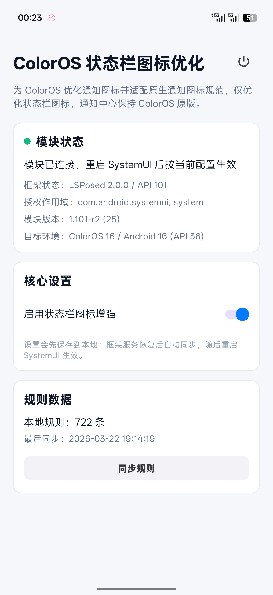

# OStatus - ColorOS 状态栏通知图标增强优化


基于 [ColorOS 通知图标增强](https://github.com/fankes/ColorOSNotifyIcon) 的精简重构版本，专注状态栏图标优化。

为 ColorOS 优化通知图标以及适配原生通知图标规范，理论支持 OxygenOS 和 RealmeUI。

## For Non-Chinese Users

This project will not be adapted i18n, please stay tuned for my new projects in the future.

## 模块截图



## 关于原项目

> **重构起因：** 原项目最新的提交代码存在问题，会导致系统日志持续输出并引发严重的耗电现象。目前原作者 **并未停止维护**，只是工作繁忙暂时抽不出空来修复，后续计划推出整合模块。
>
> 在此背景下，本分支基于 [fankes/ColorOSNotifyIcon](https://github.com/fankes/ColorOSNotifyIcon) 进行了修复，在解决严重耗电痛点并保留原始开源协议、版权信息与致谢名单的前提下，进行了大幅的精简与重构。

## 重构内容

相较于原版，OStatus 主要做了以下调整：

- **迁移至 libxposed API 101**，移除 legacy Xposed / rovo89 API / YukiHookAPI 等历史兼容层
- **去除冗余功能，仅优化状态栏图标**，通知中心保持 ColorOS 原版（修改通知中心图标反而突兀）
- **优化图标尺寸**，新增出图前归一化处理（透明裁边 + 统一输出尺寸），修复部分在线规则图在状态栏显示过小的问题
- 作用域固定为：`system`、`com.android.systemui`
- 不再提供旧版 ColorOS / Android 分支兼容逻辑
- 所有设置修改后统一通过 **重启 SystemUI** 生效，不做热更新（**第一次安装请同步规则，然后重启手机**）

### 当前维护目标

- **仅支持 ColorOS 16 / Android 16（API 36）**
- **仅支持 modern libxposed API 101 / LSPosed**
- 以**低耗电、少日志、少热路径反射**为优先目标

### 图标逻辑

- **状态栏图标**：由模块接管，优先使用在线规则与原始通知小图标进行优化
- **通知中心图标**：保持 ColorOS 原版行为，不做额外改写
- 对于无规则应用，会尽量回退到原始 `smallIcon`，避免被系统强制改成不合适的形状

## 使用说明

1. 在 LSPosed 中启用模块
2. 勾选作用域：`system`、`com.android.systemui`
3. 打开 App 同步规则
4. 点击"重启 SystemUI"使设置生效

> 若本次更新包含 `system_server` 逻辑调整，首次更新后建议完整重启一次系统，以确保新 Hook 全部生效。

## 规则来源

本模块继续使用 `AndroidNotifyIconAdapt` 规则仓库：

- [Android 通知图标规范适配计划](https://github.com/fankes/AndroidNotifyIconAdapt)
- [ColorOS 规则](https://raw.githubusercontent.com/fankes/AndroidNotifyIconAdapt/main/OS/ColorOS/NotifyIconsSupportConfig.json)
- [APP 规则](https://raw.githubusercontent.com/fankes/AndroidNotifyIconAdapt/main/APP/NotifyIconsSupportConfig.json)

## 历史背景

ColorOS 虽然支持原生通知图标规范，但系统与第三方推送长期存在彩色图标、风格不统一、系统强制替换小图标等问题，影响状态栏一致性与可读性。

本重构版本选择收敛目标：只处理**状态栏图标优化**，尽量减少对通知中心与 SystemUI 热路径的侵入，以换取更稳定的行为和更低的额外功耗。

## 贡献通知图标优化名单

此项目是 `AndroidNotifyIconAdapt` 项目的一部分，详情请参考下方。

- [Android 通知图标规范适配计划](https://github.com/fankes/AndroidNotifyIconAdapt)

## 注意事项

1. 本软件免费、由兴趣驱动开发，仅供学习交流使用。如果你是从其他非官方渠道付费获得本软件，可能已遭遇欺诈，欢迎向我们举报可疑行为。
2. 本软件采用 **GNU Affero General Public License (AGPL 3.0)** 许可证。根据该许可证的要求：

   - 任何衍生作品必须采用相同的 AGPL 许可证
   - 分发本软件或其修改版本时，必须提供完整的源代码
   - 必须保留原始的版权声明及许可证信息
   - 不得额外施加限制来限制他人对本软件的自由使用
3. 我们鼓励在遵守 AGPL 3.0 条款的前提下进行自由传播和改进，但请尊重作者署名权，勿冒用原作者名义。

## 隐私政策

- [PRIVACY](PRIVACY.md)

## 许可证

- [AGPL-3.0](https://www.gnu.org/licenses/agpl-3.0.html)

```
Copyright (C) 20174 Fankes Studio(qzmmcn@163.com)

This program is free software: you can redistribute it and/or modify
it under the terms of the GNU Affero General Public License as
published by the Free Software Foundation, either version 3 of the
License, or (at your option) any later version.

This program is distributed in the hope that it will be useful,
but WITHOUT ANY WARRANTY; without even the implied warranty of
MERCHANTABILITY or FITNESS FOR A PARTICULAR PURPOSE.  See the
GNU Affero General Public License for more details.

You should have received a copy of the GNU Affero General Public License
along with this program.  If not, see <https://www.gnu.org/licenses/>.
```

Powered by [modern libxposed API](https://github.com/libxposed/api)

版权所有 © 20174 Fankes Studio(qzmmcn@163.com)
